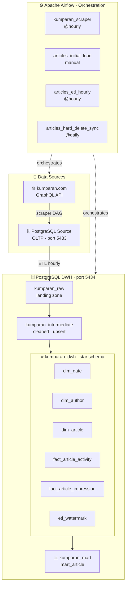

# Kumparan Data Engineer Assessment

**Stack:** Apache Airflow 2.9 · PostgreSQL (Source OLTP) · PostgreSQL (DWH, Redshift-compatible)

> **DWH Target:** Amazon Redshift (production architecture).  
> Untuk demo lokal digunakan PostgreSQL dengan schema yang identik — karena Redshift menggunakan
> PostgreSQL-compatible SQL. Di production, cukup swap `db.py` connection helper ke `redshift_connector`
> tanpa mengubah satu baris pun di DAG.

---

## Architecture



> **Catatan tentang `kumparan_scraper` DAG:** DAG ini adalah *data ingestion layer* opsional
> yang mengisi Source DB dengan data real dari kumparan.com via GraphQL API.
> Pipeline ETL utama (`articles_etl_hourly`) beroperasi dari Source DB → DWH, sesuai requirement soal.
> Scraper berjalan sebelum ETL hourly agar Source DB selalu memiliki data terbaru.

---

## Dimensional Model (Star Schema)


**Grain:**
- `fact_article_activity` — satu baris per artikel (snapshot terbaru lifecycle artikel)
- `fact_article_impression` — satu baris per read event (grain paling detail)

---

## DAGs


| DAG | Schedule | Tujuan |
|-----|----------|--------|
| `kumparan_scraper` | `@hourly` | Scrape artikel real dari kumparan.com → Source DB + DQ check |
| `articles_initial_load` | Manual (sekali) | Backfill historis 2016 → sekarang, batch per bulan |
| `articles_etl_hourly` | `@hourly` | Incremental ELT: Source DB → RAW → Intermediate → Gold → Mart |
| `articles_hard_delete_sync` | `0 0 * * *` | Reconcile hard deletes source vs DWH (daily) |

---

## Cara Run Lokal (Step by Step)

### 1. Pastikan Docker Desktop sudah jalan

### 2. Clone / extract project
```bash
unzip kumparan-de-assessment.zip
cd kumparan-de-v2
```

### 3. Jalanin semua service
```bash
docker compose up -d
```

Pertama kali agak lama (~2-3 menit) karena download image.

### 4. Cek semua container jalan
```bash
docker compose ps
```
Semua harus `running`. Tunggu `kumparan_airflow_init` selesai dulu (status `Exited (0)`).

### 5. Buka Airflow UI
```
http://localhost:8080
Username: admin
Password: admin
```

### 6. (Opsional) Jalankan scraper untuk isi Source DB dengan data real
1. Klik DAG **`kumparan_scraper`**
2. Klik **▶ Trigger DAG**
3. Tunggu sampai semua task hijau

> Jika skip step ini, Source DB tetap bisa diisi dengan data dummy via `articles_initial_load`.

### 7. Trigger initial load (backfill 2016)
1. Klik DAG **`articles_initial_load`**
2. Klik **▶ Trigger DAG w/ config** (pojok kanan atas)
3. Klik **Trigger** (parameter default sudah oke)
4. Klik **Graph** untuk lihat progress

### 8. Aktifkan DAG hourly & hard delete sync
Setelah initial load **semua task hijau**:
1. Toggle **`articles_etl_hourly`** → ON
2. Toggle **`articles_hard_delete_sync`** → ON

---

## Verifikasi Data di DWH


Connect ke DWH PostgreSQL via DBeaver atau psql:
```
Host: localhost
Port: 5434
Database: kumparan_dwh
User: dwh_user
Password: dwh_pass
```

Query verifikasi:
```sql
-- Cek watermark
SELECT * FROM kumparan_dwh.etl_watermark;

-- Jumlah data per tabel
SELECT 'dim_author'              AS tbl, COUNT(*) AS rows FROM kumparan_dwh.dim_author
UNION ALL
SELECT 'dim_article',                    COUNT(*)         FROM kumparan_dwh.dim_article
UNION ALL
SELECT 'fact_article_activity',          COUNT(*)         FROM kumparan_dwh.fact_article_activity
UNION ALL
SELECT 'fact_article_impression',        COUNT(*)         FROM kumparan_dwh.fact_article_impression;

-- Artikel per tahun (harus ada 2016–sekarang)
SELECT d.year, COUNT(*) AS articles
FROM kumparan_dwh.fact_article_activity f
JOIN kumparan_dwh.dim_date d ON d.date_key = f.created_date_key
WHERE f.is_deleted = FALSE
GROUP BY d.year ORDER BY d.year;

-- Top author by article count
SELECT da.author_id, COUNT(*) AS total
FROM kumparan_dwh.fact_article_activity f
JOIN kumparan_dwh.dim_author da ON da.author_key = f.author_key
WHERE f.is_deleted = FALSE
GROUP BY da.author_id ORDER BY total DESC LIMIT 10;

-- DQ report (dari scraper)
SELECT scraped_at::DATE AS date, COUNT(*) AS total,
       SUM(CASE WHEN dq_ok THEN 1 ELSE 0 END) AS passed,
       SUM(CASE WHEN NOT dq_ok THEN 1 ELSE 0 END) AS failed
FROM kumparan_raw.dq_report
GROUP BY 1 ORDER BY 1 DESC;
```

---

## Incremental Strategy

```
Tiap jam (articles_etl_hourly):
  watermark = SELECT last_updated_at FROM etl_watermark  (default: 2016-01-01)

  rows = SELECT * FROM articles WHERE updated_at >= watermark AND updated_at < NOW()

  ┌─ covers ──────────────────────────┐
  │  INSERT baru   → updated_at baru  │
  │  UPDATE konten → updated_at baru  │
  │  Soft DELETE   → deleted_at set,  │
  │                  updated_at bump  │
  └───────────────────────────────────┘

  Pipeline: RAW (append) → Intermediate (upsert) → Gold dims/facts → Mart refresh

  Watermark hanya diupdate setelah SEMUA task sukses → no data loss on failure
```

---

## Bonus: Jawaban Pertanyaan Soal

### 1. ETL baru, data dari 2016 — apa yang perlu dipertimbangkan?

- **Volume besar**: data 8+ tahun tidak bisa di-load sekaligus → `articles_initial_load` memproses data **batch per bulan** (`_month_ranges`) untuk menghindari memory spike dan timeout
- **Idempotency**: jika initial load gagal di tengah jalan, bisa di-rerun tanpa duplikasi karena semua INSERT menggunakan `ON CONFLICT DO UPDATE / DO NOTHING`
- **Urutan load**: `dim_date` harus diisi lebih dulu (2016–2036) sebelum tabel lain, karena `dim_article` dan `fact_*` memiliki FK ke `dim_date`
- **Watermark handoff**: setelah initial load selesai, watermark di-set ke `NOW()` sehingga `articles_etl_hourly` langsung take over tanpa overlap atau gap data

### 2. Hard delete — bagaimana DWH tetap sinkron?

Karena row yang di-hard delete **hilang dari source DB secara fisik**, `updated_at` tidak berubah — sehingga hourly ETL berbasis watermark tidak akan pernah mendeteksinya.

**Solusi dual-layer:**

1. **Trigger di Source DB** (`trg_article_hard_delete`): setiap row yang didelete dari `articles` otomatis dicatat ID-nya ke tabel `article_deleted`

2. **`articles_hard_delete_sync` DAG** (jalan tiap hari): full ID reconciliation — membandingkan semua article IDs di source vs semua active IDs di DWH. IDs yang ada di DWH tapi hilang dari source di-mark `is_deleted = TRUE` di `dim_article` dan `fact_article_activity`

Data di DWH **tidak dihapus fisik** — tetap ada untuk keperluan audit dan analisis historis, hanya ditandai sebagai deleted.

---

## Project Structure

```
kumparan-de-v2/
├── dags/
│   ├── kumparan_scraper.py            ← Hourly scraper kumparan.com → Source DB + DQ check
│   ├── articles_initial_load.py       ← One-time historical backfill (2016 → now)
│   ├── articles_etl_hourly.py         ← Hourly incremental ELT (Source DB → DWH)
│   └── articles_hard_delete_sync.py   ← Daily hard delete reconciliation
├── include/
│   ├── db.py                          ← DB connection helpers + watermark utils
│   ├── scraper.py                     ← Kumparan GraphQL scraping logic
│   └── utils.py                       ← Shared transform helpers (age_group, device_class, dll)
├── sql/
│   ├── 01_source_ddl.sql              ← Source schema + trigger hard delete
│   └── 03_dwh_ddl.sql                 ← Star schema (Redshift-compatible), 4 schemas
├── docker-compose.yml                 ← Full local stack (Airflow + Source DB + DWH)
└── README.md
```
